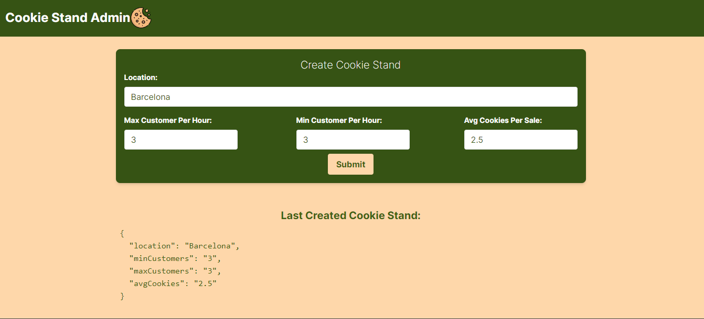

# Cookie Stand App (Next.js)

This is a simple web application for managing cookie stand locations, built with Next.js. It allows you to create and view cookie stand data.

## How To Run the APp

To run this Next.js application locally, follow these steps:
+ First =ownload the Node.js source code => [Node.js](https://nodejs.org/en/download)
+ Clone the repo to your device => 
   ```shell
   git clone https://github.com/your-username/cookie-stand-app-nextjs.git

+ Run the command
    ```shell
      npm run dev
to see This result the app     


